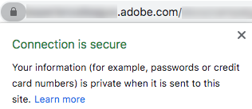
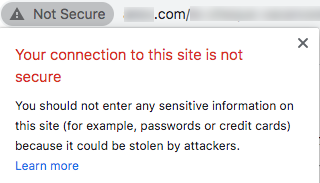

# SSL 証明書要求プロセス

電子メールの送信用にドメインをAdobeにデリゲートすると（[&#x200B; ドメイン名の設定](/help/additional-resources/ac-domain-name-setup.md)を参照）、Adobeは特定の機能に対して特定のサブドメインを作成して使用します。

例えば、メール送信用に&#x200B;*email.example.com*&#x200B;をAdobeにデリゲートした場合、Adobeは次のようなサブドメインを作成します。
* *t.email.example.com* - トラッキングリンク用
* *m.email.example.com* - ミラーページ用
* *res.email.example.com* - ホストされているリソース （画像など）の場合

これらのドメインは、**SSL （HTTPS）**&#x200B;を介して保護することをお勧めします。 確かに、保護されていないリンク（HTTP）はインターセプトに対して脆弱であり、最新のブラウザーで警告が表示されます。

これらのサブドメインにSSL証明書をインストールするには、CSR ファイルをリクエストし、その後、AdobeのSSL証明書を購入してインストールまたは更新する必要があります。

>[!CAUTION]
>
>SSL証明書をインストールする前に、[このページ &#x200B;](https://experienceleague.adobe.com/docs/control-panel/using/subdomains-and-certificates/renewing-subdomain-certificate.html?lang=ja#installing-ssl-certificate)に記載されている前提条件を確認してください。
>
>Adobeは、最大2048 ビットの証明書のみをサポートします。 4096 ビットの証明書はまだサポートされていません。

## 用語集

| 用語 | 説明 |
|--- |--- |
| CA （認証局） | DigiCert、SymantecなどのIDを確認した後、組織または個人にデジタル証明書を発行するSSL証明書プロバイダー。<ul><li>信頼できるCAは、通常、ルート証明書を発行するサードパーティのCAと見なされます。</li><li>証明書が証明書を使用している同じ組織または会社によって署名されている場合、自己署名証明書などのSSL証明書であっても、信頼できないCAとして分類されます。</li></ul> |
| チェーン証明書 | ルート証明書と1つ以上の中間証明書を含む証明書は、チェーン証明書（またはチェーン証明書）と呼ばれます。 |
| CSR （証明書署名要求） | SSL証明書を申請する際に認証局に与えられる、エンコードされたテキストブロック。 通常、証明書がインストールされているサーバーで生成されます。 |
| DER （Distinguished Encoding Rules） | 証明書の拡張タイプ。 .der拡張子は、バイナリ DER エンコードされた証明書に使用されます。 これらのファイルは.cerまたは.crt拡張子もサポートしています。 |
| EV （Extended Validation）証明書 | EV証明書は、フィッシング攻撃を防ぐために設計された新しいタイプの証明書です。 それには、お客様のビジネスと証明書を注文する人の拡張検証が必要です。 |
| 高い保証証明書 | 高い保証の証明書は、ドメイン名と有効な事業登録の所有権を確認した後、CAによって発行されます。 |
| 中間型CA | チェーン証明書に含まれる中間証明書の認証局。 |
| 中間証明書 | 認証局は、ツリー構造の形式で証明書を発行します。 ルート証明書は、ツリーの最上位の証明書です。 証明書とルート証明書の間にある証明書は、チェーン証明書または中間証明書と呼ばれます。 |
| 低い保証証明書 | 低い保証の証明書は、ドメイン検証済み証明書とも呼ばれ、証明書にドメイン名のみが含まれます（ビジネス/組織名は含まれません）。 |
| PEM （プライバシー強化メール） | ASCII （Base64） データを含む.pem拡張子の証明書。 このような証明書は、「 – - - - - - - BEGIN CERTIFICATE - - - - - – 」行で始まります。 |
| ルート証明書 | 認証局は、ツリー構造の形式で証明書を発行します。 ルート証明書は、ツリーの最上位の証明書です。 |
| SAN （サブジェクトの代替名） | サブジェクトの代替名は、追加のホスト名（サイト、IP アドレス、共通名など）です。 単一のSSL証明書の一部として署名する必要があります。 |
| 自己署名証明書 | 信頼できる認証局ではなく、作成するユーザーによって署名された証明書。 自己署名証明書は、CAによって署名された証明書と同じレベルの暗号化を有効にできますが、大きな欠点が2つあります。<ul><li>訪問者の接続をハイジャックして、攻撃者が送信されたすべてのデータを表示できるようにする可能性があります（したがって、接続を暗号化する目的を損なう）</li><li> 信頼できる証明書のように、証明書を失効させることはできません。</li></ul> |
| SSL （セキュアソケットレイヤー） | Web サーバとブラウザとの間に暗号化されたリンクを確立するための標準的なセキュリティ技術。 |
| ワイルドカード証明書 | ワイルドカード証明書は、1つのドメイン名（*.adobe.comなど）に対して無制限の数のファーストレベルのサブドメインを保護できます。 |

## 主な手順

1. 証明書署名要求（CSR）ファイルを要求し、必要な情報（国、州、都市、組織名、組織単位名など）を提供します。 Adobeに接続されます。
1. Adobeによって生成されたCSR ファイルを検証し、提供されたすべての情報が正しいことを確認します。
1. CSRの詳細を使用して、信頼できる証明機関<!--taking care of asking for using the subjectAltName SSL extension (SAN) if it is for several domain names, and get/purchase the resulting certificate (ideally) in PEM format for Apache server-->によって署名された証明書を生成します。
1. SSL証明書を検証し、CSRと一致することを確認します。
1. SSL証明書をAdobeに提供し、インストールします。
1. セキュリティで保護された各サブドメインに対して、SSL証明書が正常にインストールされていることをテストします。
1. SSL証明書の有効期間を監視します。
1. Adobe Campaignの特定の設定を更新します。

## 詳細なプロセス

### 前提条件

ドメイン名と機能（トラッキング、ミラーページ、web アプリなど）を特定する必要があります。 セキュリティを確保できます。
>[!NOTE]
>
>Adobeは、関連するドメイン名と機能の定義に役立ちます。 詳しくは、Adobe アカウントチームにお問い合わせください。

### 手順1 - CSR ファイルを取得する

CSR （証明書署名要求）ファイルを取得するには、次の手順に従います。

* [Campaign コントロールパネル](https://experienceleague.adobe.com/docs/control-panel/using/control-panel-home.html?lang=ja)にアクセスできる場合は、[このページ &#x200B;](https://experienceleague.adobe.com/docs/control-panel/using/subdomains-and-certificates/renewing-subdomain-certificate.html?lang=ja#subdomains-and-certificates)の手順に従って、CSR ファイルを生成し、Campaign コントロールパネルからダウンロードしてください。

* それ以外の場合は、https://adminconsole.adobe.com/を介してサポートチケットを作成し、必要なサブドメインのCSR ファイルをAdobe カスタマーケアから取得します。

そのベストプラクティスをいくつか紹介します。

* デリゲートされたサブドメインごとに1つのリクエストを発生させます。
* 複数のサブドメインを単一のCSR リクエストに組み合わせることは可能ですが、同じ環境内でのみ可能です。 例えば、Campaign Classicでは、マーケティングサーバー、[&#x200B; ミッドソーシングサーバー](https://experienceleague.adobe.com/docs/campaign-classic/using/installing-campaign-classic/install-campaign-on-prem/mid-sourcing-server.html?lang=ja)、[実行インスタンス &#x200B;](https://experienceleague.adobe.com/docs/campaign-classic/using/transactional-messaging/configure-transactional-messaging/configuring-instances.html?lang=ja#execution-instance)は3つの別々の環境です。
* SSL証明書を更新するには、新しいCSRを取得する必要があります。 1年以上前の古いCSR ファイルは使用しないでください。

次の情報を提供する必要があります。

>[!CAUTION]
>
>以下の表に示すフィールドはすべて入力する必要があります。 それ以外の場合、CSR リクエストは処理できません。

**Adobe チームの支援を提供するための情報：**

| 提供するための情報 | 値の例 | メモ |
|--- |--- |--- |
| クライアント名 | 株式会社マイ・カンパニー | 組織の名前。 このフィールドは、リクエストをトラッキングするためにAdobeで使用されます（CSR/SSL証明書の一部にはなりません）。 |
| Adobe Campaign環境URL | https://client-mid-prod1.campaign.adobe.com | Adobe Campaign インスタンス URL。 |
| 共通名[CN] | t.subdomain.customer.com | これは関連ドメインのいずれかですが、通常はトラッキングドメインです。 |
| サブジェクトの代替名[SAN] | t.subdomain.customer.com | トラッキングサブドメインをSANとして含めるようにしてください。 |
| サブジェクトの代替名[SAN] | m.subdomain.customer.com | |
| サブジェクトの代替名[SAN] | res.subdomain.customer.com | |

**IT/SSL社内チームが提供する情報：**

| 提供するための情報 | 値の例 | メモ |
|--- |--- |--- |
| 国[C] | 米国 | これは2文字のコードである必要があります。 完全な国名リスト [こちら](https://www.ssl.com/csrs/country_codes/)にアクセスします。 *注意：英国の場合は、GB （英国ではなく）を使用します。* |
| 都道府県（または都道府県名） [ST] | イリノイ州 | 該当する場合。 値は、省略化ではなくフルネームである必要があります。 |
| 市区町村名[L] | シカゴ | |
| 組織名[O] | ACME | |
| 組織単位名[OU] | IT | |

>[!NOTE]
>
>「subdomain.customer.com」をデリゲートされたサブドメインに置き換え、その他の例の値を適切な値に置き換えます。

### 手順2 - CSR ファイルの検証

リクエストを関連情報とともに送信すると、Adobeは証明書の署名リクエスト（CSR）ファイルを生成して提供します。

結果のCSR ファイルのテキストは、**&quot;-----BEGIN CERTIFICATE REQUEST-----&quot;**&#x200B;で始まる必要があります。

AdobeからCSR ファイルを受け取ったら、次の手順に従います。

1. CSR ファイルのテキストをコピーして、https://www.sslshopper.com/csr-decoder.html、<!--https://www.certlogik.com/decoder/,-->、https://www.entrust.net/ssl-technical/csr-viewer.cfmなどのオンライン デコーダーに貼り付けます。
または、Linux マシン上で*OpenSSL* コマンドをローカルで使用することもできます。
1. すべてのチェックが成功したことを確認します。
1. 正しいパラメーターとドメイン名が含まれていることを確認します。
1. 他のすべてのデータが、リクエストの送信時に指定した詳細と一致することを確認してください。

### 手順3 - SSL証明書を生成する

CSR ファイルを指定したら、CSR ファイルを使用して、適切なドメインのSSL証明書を購入して生成する必要があります。

* SSL証明書：
   * Apache PEM形式である必要があります。
   * 2048 ビットを超えてはなりません。
   * 有効なCA （認証機関）による署名が必要です。
   * CSR ファイルに記載されているすべてのSAN （サブジェクト代替名）を含める必要があります。
* 1つ以上の中間証明書がある場合は、ルート証明書とすべての中間証明書をAdobeに提供する必要があります。
* 証明書の有効期間は設定できますが、Adobeでは十分な期間（例えば2年）を選択することをお勧めします。

>[!NOTE]
>
>独自の内部ツールまたはCAが提供するポータルを使用して証明書をリクエストする場合は、必ずCSR リクエストと同じ詳細を使用して、証明書生成プロセスの遅延や矛盾を回避してください。

### 手順4 - SSL証明書の検証

SSL証明書が生成されたら、Adobeに送信する前に検証する必要があります。 これを行うには、以下の手順に従います。

1. 証明書の拡張子が.pemであることを確認します。 そうでない場合は、PEM形式に変換してください。 *OpenSSL*&#x200B;を使用して変換を行うことができます。
1. 証明書が&#x200B;**&quot;-----BEGIN CERTIFICATE-----&quot;**&#x200B;で始まることを確認してください。
1. 証明書テキストをhttps://www.sslshopper.com/certificate-decoder.htmlやhttps://www.entrust.net/ssl-technical/csr-viewer.cfmなどのオンラインデコーダーにコピーします。
または、Linux マシン上で*OpenSSL* コマンドをローカルで使用することもできます。 詳しくは、[この外部ページ &#x200B;](https://www.shellhacks.com/decode-ssl-certificate/)を参照してください。
1. Common Name、SAN、Issuer、Validity Periodを含め、証明書が適切に解決されていることを確認します。
1. SSL証明書の検証が成功した場合は、[このweb サイト &#x200B;](https://www.sslshopper.com/certificate-key-matcher.html)を使用して、証明書がCSRと一致することを確認します。**CSRと証明書が一致するかどうかを確認**&#x200B;を選択し、証明書とCSRを対応するフィールドに入力します。 彼らは一致するべきです。

### 手順5 - SSL証明書のインストールをリクエストする

* [Campaign コントロールパネル](https://experienceleague.adobe.com/docs/control-panel/using/control-panel-home.html?lang=ja)にアクセスできる場合は、[このページ &#x200B;](https://experienceleague.adobe.com/docs/control-panel/using/subdomains-and-certificates/renewing-subdomain-certificate.html?lang=ja#installing-ssl-certificate)の手順に従って、証明書をCampaign コントロールパネルにアップロードしてください。

* それ以外の場合は、https://adminconsole.adobe.com/を介して別のサポートチケットを作成し、Adobeに証明書のAdobe サーバーへのインストールをリクエストします。

次のようなものがあります。

* 証明書ファイル、ルート証明書、および任意の中間証明書（チケットに添付）（できればApache PEM形式）。
* CSRに対して発行された以前のサポートチケットの数。
* CSR チケット用に提供された同じデータ（Common Name、Instance URL、State、City/Locality、Organization Name、Organization Unit Nameなど）。

### 手順6 - SSL証明書のインストールをテストする

SSL証明書がAdobe カスタマーケアによってインストールされ、確認されたら、すべてのURLに対して正常にインストールされていることを確認します。

SSL インストールチケットを閉じる前に、以下のテストを実行します。 また、[このセクション &#x200B;](#update-configuration)で指示されている特定の設定を必ず更新してください。

ブラウザーで次のURLに移動します（「subdomain.customer.com」をサブドメインに置き換えます）。

* https://subdomain.customer.com/r/test （[web アプリケーション &#x200B;](https://experienceleague.adobe.com/docs/campaign-classic/using/designing-content/web-applications/about-web-applications.html?lang=ja) サブドメインのみ – メールサブドメインには適用されません）
* https://t.subdomain.customer.com/r/test
* https://m.subdomain.customer.com/r/test
* https://res.subdomain.customer.com/r/test

正常な結果は環境情報を提供し、URLのアドレスバーは接続が安全であることを示します。 例えば、Google Chromeでは次のメッセージが表示されます。

SSL証明書が正しくインストールされていない場合は、次の警告が表示されます。

### 手順7 – 証明書の有効期間を確認する

ブラウザーで証明書の有効期間を確認できます。 例えば、Google Chromeで、**Secure** > **Certificate**&#x200B;をクリックします。

有効期限を確認するのはあなたの責任です。 Adobeでは、証明書の有効期限を監視するプロセスを実装することをお勧めします。 SSL証明書の有効期限が切れるときの処理について詳しくは、[この記事](https://www.thesslstore.com/blog/what-happens-when-your-ssl-certificate-expires/)を参照してください。

* サポートチケットを作成して、証明書の有効期限の少なくとも2週間前に更新された証明書をリクエストします。 CSRの詳細が変更されていない限り、追加のCSRをリクエストする必要はありません。

* [Campaign コントロールパネル](https://experienceleague.adobe.com/docs/control-panel/using/control-panel-home.html?lang=ja)へのアクセス権があり、環境がAdobeによってAWS環境でホストされている場合は、Campaign コントロールパネルを使用して、有効期限が切れる前に証明書を更新できます。 詳しくは、[この節](https://experienceleague.adobe.com/docs/control-panel/using/subdomains-and-certificates/monitoring-ssl-certificates.html?lang=ja#monitoring-certificates)を参照してください。

### 手順8 – 特定の設定を更新する {#update-configuration}

要求されたSSL証明書が正しくインストールされていることを確認したら、Adobe Campaignのすべての参照をHTTPからHTTPSに更新できます。

>[!NOTE]
>
>Campaign Classicの場合、更新するURLは、主に[&#x200B; デプロイメントウィザード &#x200B;](https://experienceleague.adobe.com/docs/campaign-classic/using/installing-campaign-classic/initial-configuration/deploying-an-instance.html#deployment-wizard)および[外部アカウント &#x200B;](https://experienceleague.adobe.com/docs/campaign-classic/using/installing-campaign-classic/accessing-external-database/external-accounts.html?lang=ja) （トラッキング、ミラーページ、パブリックリソースドメイン）にあります。 Campaign Standardについては、[&#x200B; ブランディング設定](https://experienceleague.adobe.com/docs/campaign-standard/using/administrating/application-settings/branding.html?lang=ja#about-brand-identity)を参照してください。

設定が更新されると、HTTPではなくHTTPS URLを使用して新しいメールが送信されます。 URLがセキュリティで保護されていることを確認するには、次のテストをすばやく実行できます。

* Adobe Campaignから画像をアップロードします。 画像がアップロードされたら、返されるURLはHTTPSである必要があります。
* ミラーページのリンク、画像、テキスト、購読解除リンクを含むテストメール配信を作成します。 外部のメール ID （Gmail アドレスなど）にメールを送信します。 電子メールを受信したら、電子メールを開き、電子メール内のすべてのリンクが、SSL証明書の警告やエラーなしに、HTTPではなくHTTPS フォームで正しく開かれていることを確認します。

## 製品固有のリソース

**Campaign Classic**

* [Campaign コントロールパネル: SSL証明書の追加（チュートリアル） &#x200B;](https://experienceleague.adobe.com/docs/campaign-classic-learn/control-panel/subdomains-and-certificates/adding-ssl-certificates.html?lang=ja) - サブドメインを保護するためにSSL証明書を追加する方法を説明します。

**Campaign Standard**

* [Campaign コントロールパネル: SSL証明書の追加（チュートリアル） &#x200B;](https://experienceleague.adobe.com/docs/campaign-standard-learn/control-panel/subdomains-and-certificates/adding-ssl-certificates.html?lang=ja) - サブドメインを保護するためにSSL証明書を追加する方法を説明します。
