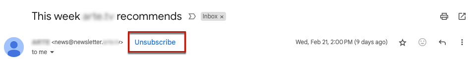
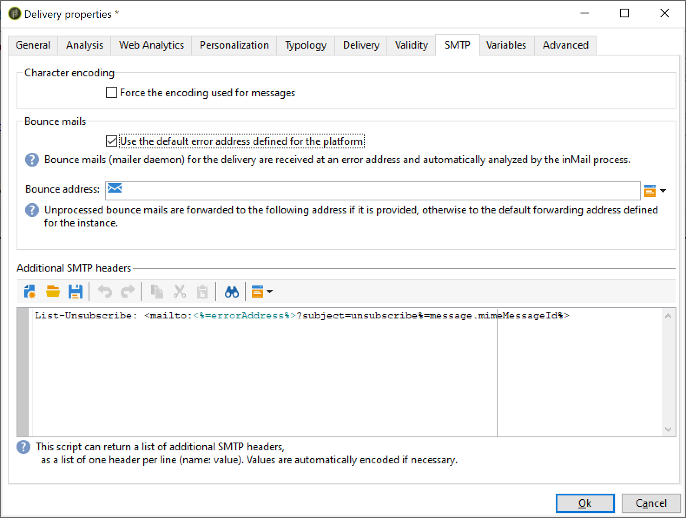
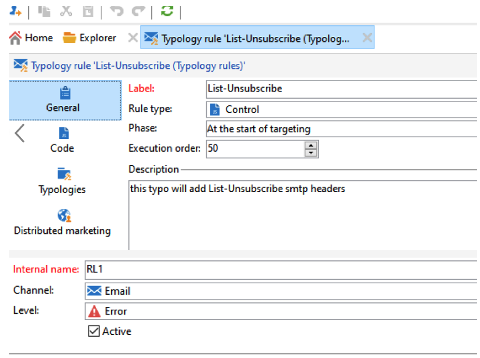
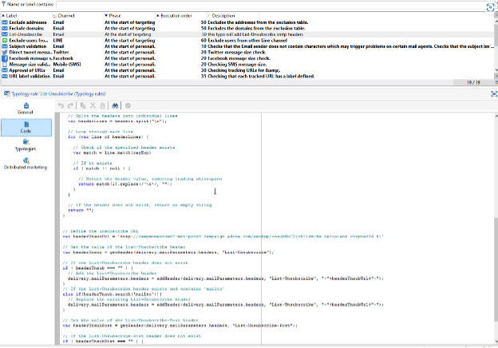
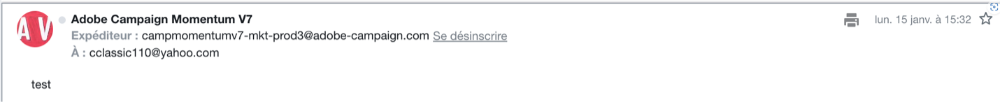

# Campaign Classic - 技術的なレコメンデーション {#technical-recommendations}

Adobe Campaign Classicを使用する際に、配信率を向上させるために使用できるいくつかの手法、設定、ツールを以下に示します。

## 設定 {#configuration}

### 逆引きDNS {#reverse-dns}

Adobe Campaign は、IP アドレスに対してリバース DNS が提供されているかどうか、そのリバース DNS が正しく IP を指しているかどうかを確認します。

ネットワーク設定で重要な点は、送信メッセージの IP アドレスごとに正しいリバース DNS が必ず定義されるようにすることです。 つまり、特定の IP アドレスには、最初の IP アドレスにループバックする対応 DNS（A レコード）を記述したリバース DNS レコード（PTR レコード）があるということです。

特定の ISP を扱う場合には、リバース DNS のドメイン選択が影響を及ぼします。 特に、AOL は、リバース DNS と同じドメインに属するアドレスのフィードバックループのみを受け付けます（[フィードバックループ](#feedback-loop)を参照）。

>[!NOTE]
>
>[この外部ツール &#x200B;](https://mxtoolbox.com/SuperTool.aspx)を使用して、ドメインの設定を検証できます。

### MX ルール {#mx-rules}

MX（Mail eXchanger）ルールは、送信サーバーと受信サーバーの間の通信を管理するルールです。

より正確には、Adobe Campaign MTA （Message Transfer Agent）が個々のメールドメインまたはISP （hotmail.com、comcast.netなど）に送信するメールの速度を制御するために使用されます。 これらのルールは通常、ISPによって公開される制限に基づいています（例えば、各SMTP接続ごとに20を超えるメッセージを含めないでください）。

>[!NOTE]
>
>Adobe Campaign ClassicでのMX管理について詳しくは、[この節](https://experienceleague.adobe.com/docs/campaign-classic/using/installing-campaign-classic/additional-configurations/email-deliverability.html#mx-configuration)を参照してください。

### TLS {#tls}

TLS（トランスポート層セキュリティ）は、暗号化プロトコルで、2 つのメールサーバー間の接続を保護したり、メールのコンテンツを保護して意図された受信者以外によって読まれないようにするために使用できます。

### 送信者のドメイン {#sender-domain}

HELO コマンドに使用するドメインを定義するには、インスタンスの設定ファイル（conf/config-instance.xml）を編集し、「localDomain」属性を次のように定義します。

```
<serverConf>
  <shared>
    <dnsConfig localDomain="mydomain.net"/>
  </shared>
</serverConf>
```

MAIL FROM ドメインは、テクニカルバウンスメッセージで使用されるドメインです。 このアドレスは、デプロイメントウィザードまたはNmsEmail_DefaultErrorAddr オプションで定義されます。

### SPF レコード {#dns-configuration}

現在、SPF レコードは、DNS サーバー上でTXT タイプ レコード（コード 16）またはSPF タイプ レコード（コード 99）として定義できます。 SPF レコードは、文字列の形式を取ります。 例：

```
v=spf1 ip4:12.34.56.78/32 ip4:12.34.56.79/32 ~all
```

2つのIP アドレス（12.34.56.78と12.34.56.79）を、ドメインのメール送信が許可されたアドレスとして定義します。 **～all**&#x200B;は、他のアドレスをソフトフェイルとして解釈する必要があることを意味します。

SPF レコードを定義するための推奨事項：

* 末尾に&#x200B;**～all** （SoftFail）または&#x200B;**-all** （Fail）を追加して、定義されたサーバー以外のすべてのサーバーを拒否します。 これがなければ、サーバーはこのドメインを（中立的な評価で）偽造できます。
* **ptr**&#x200B;を追加しないでください（openspf.orgでは、コストが高く信頼性が低いと推奨されています）。

>[!NOTE]
>
>SPFの詳細については、[このセクション &#x200B;](/help/additional-resources/authentication.md#spf)を参照してください。

## 認証

>[!NOTE]
>
>様々な形式のメール認証について詳しくは、[この節](/help/additional-resources/authentication.md)を参照してください。

### DKIM {#dkim-acc}

>[!NOTE]
>
>ホストインストールまたはハイブリッドインストールで [Enhanced MTA](https://experienceleague.adobe.com/docs/campaign-classic/using/sending-messages/sending-emails/sending-an-email/sending-with-enhanced-mta.html#sending-messages) にアップグレードした場合、すべてのドメインのすべてのメッセージに対する DKIM のメール認証署名は、Enhanced MTA がおこないます。

Adobe Campaign Classicで[DKIM](/help/additional-resources/authentication.md#dkim)を使用するには、次の前提条件が必要です。

**Adobe Campaign オプション宣言**: Adobe Campaignでは、DKIM秘密鍵はDKIM セレクターとドメインに基づいています。 同じドメイン／サブドメインに対して、セレクターの異なる複数の秘密鍵を作成することは、現時点ではできません。 プラットフォームでもメールでも、どのセレクタードメイン／サブドメインを認証に使用すべきかを定義することはできません。 プラットフォームでは、その代わりに、秘密鍵のいずれか 1 つを選択します。つまり、認証は失敗する可能性が高くなります。

* お使いの Adobe Campaign インスタンスに DomainKeys を設定してある場合は、[ドメイン管理ルール](https://experienceleague.adobe.com/docs/campaign-classic/using/sending-messages/monitoring-deliveries/understanding-delivery-failures.html#email-management-rules)で **dkim** を選択するだけです。 そうでない場合は、（DKIMに代わる） DomainKeysと同じ設定手順（秘密鍵/公開鍵）に従います。
* DKIM は DomainKeys の改良版なので、同じドメインに DomainKeys と DKIM の両方を有効にする必要はありません。
* 現在 DKIM が有効になっているドメインは、AOL および Gmail です。

## フィードバックループ {#feedback-loop-acc}

メッセージの送信に使用される IP アドレスの範囲に対して、特定のメールアドレスを ISP レベルで宣言することにより、フィードバックループが機能します。 ISP では、受信者からスパムとして報告されたメッセージを、バウンスメッセージの場合と同様の方法で、このメールボックスに送信します。 苦情を訴えたユーザーへの今後の配信をブロックするように、プラットフォームを設定する必要があります。 これらのユーザーが正しいオプトアウトリンクを使用しなかったとしても、そうしたユーザーにはもう連絡しないことが重要です。 これらの苦情に基づいて、ISPがIP アドレスを契約ブロックリストに追加します。 ISP によっては、苦情率がおよそ 1％になると、IP アドレスがブロックリストに登録されます。

フィードバックループメッセージの形式を定義する標準 [Abuse Feedback Reporting Format（ARF）](https://tools.ietf.org/html/rfc6650)が現在策定中です。

インスタンスのフィードバックループを実装するには、次が必要です。

* 対象インスタンス専用のメールボックス（バウンスメールボックスとなる場合があります）
* 対象インスタンス専用の IP 送信アドレス

Adobe Campaign でシンプルなフィードバックループを実装する場合は、バウンスメッセージ機能が使用されます。 フィードバックループメールボックスは、バウンスメールボックスとして使用され、これらのメッセージを検出するためのルールが定義されます。 メッセージをスパムとして報告した受信者のメールアドレスは、強制隔離リストに追加されます。

* **[!UICONTROL 管理／キャンペーン管理／配信不能件数の管理／メールルールセット]**&#x200B;で、理由として「**拒否**」、タイプとして「**ハード**」を指定してバウンスメールルール **Feedback_loop** を作成または変更します。
* メールボックスが特にフィードバックループ用に定義されている場合は、**[!UICONTROL 管理／プラットフォーム／外部アカウント]**&#x200B;で新しい外部バウンスメールアカウントを作成することにより、メールボックスにアクセスするためのパラメーターを定義します。

苦情の通知を処理するメカニズムが直ちに有効になります。 このルールが正しく機能していることを確認するには、これらのメッセージが収集されないようにアカウントを一時的に無効にした後、フィードバックループメールボックスの内容を手動で確認します。 サーバー上で、次のコマンドを順に実行します。

```
nlserver stop inMail@instance,
nlserver inMail -instance:instance -verbose.
```

複数のインスタンスに単一のフィードバックループアドレスを使用せざるを得ない場合は、次をおこなう必要があります。

* 受信したメッセージをインスタンスと同数のメールボックス上に複製します。
* インスタンスごとに各メールボックスが選択されるようにします。
* 関係するメッセージだけを処理するようにインスタンスを設定します。インスタンス情報は、Adobe Campaign から送信されるメッセージの Message-ID ヘッダーに含まれているので、フィードバックループメッセージにも含まれています。 インスタンス設定ファイルの **checkInstanceName** パラメーターを指定するだけです（デフォルトでは、インスタンスは検証されず、その結果、特定のアドレスが誤って強制隔離される可能性があります）。

  ```
  <serverConf>
    <inMail checkInstanceName="true"/>
  </serverConf>
  ```

Adobe Campaign の配信品質サービスは、以下の ISP のフィードバックループサービスへのサブスクリプションを管理します。AOL、BlueTie、Comcast、Cox、EarthLink、FastMail、Gmail、Hotmail、HostedEmail、Libero、Mail.ru、MailTrust、OpenSRS、QQ、RoadRunner、Synacor、Telenor、Terra、UnitedOnline、USA、XS4ALL、Yahoo、Yandex、Zoho。

## List-Unsubscribe {#list-unsubscribe}

配信品質の最適な管理を実現するには、**List-Unsubscribe** という SMTP ヘッダーを付けることが不可欠です。

このヘッダーは、「スパムとして報告」アイコンの代わりに使用できます。 ISPのメールインターフェイスに「登録解除」リンクとして表示されます。

この機能を利用することで、苦情率を下げ、評判を守ることができます。 フィードバックは登録解除として実行されます。

Gmail、Outlook.com、Yahoo! Microsoft Outlookはこの方法をサポートしています。 「購読解除」リンクは、そのインターフェイスで直接使用できます。 例：



>[!NOTE]
>
>「登録解除」リンクが常に表示されるとは限りません。 実際、それは各ISPの特定の基準とポリシーに依存する可能性があります。 したがって、メッセージが送信者によって送信されていることを確認します。
>
>* 高い評価を得ています
>* ISPのスパム苦情のしきい値の下
>* 完全認証

List-Unsubscribe ヘッダー機能には、次の2つのバージョンがあります。

* **&quot;mailto&quot; List-Unsubscribe** – この方法では、**登録解除** リンクをクリックすると、メールヘッダーで指定された登録解除アドレスに事前入力されたメールが送信されます。 [詳細情報](#mailto-list-unsubscribe)

* **「ワンクリック」リストの購読解除** – この方法では、**購読解除** リンクをクリックすると、ユーザーの購読解除が直接行われます。 [詳細情報](#one-click-list-unsubscribe)

>[!NOTE]
>
>2024年6月1日（PT）以降、主要なISPでは、送信者が&#x200B;**ワンクリックのリスト登録解除**&#x200B;に準拠することが求められます。

### &quot;mailto&quot; List-Unsubscribe {#mailto-list-unsubscribe}

この方法では、**登録解除** リンクをクリックすると、メールヘッダーで指定された登録解除アドレスに事前入力されたメールが送信されます。

「mailto」リストの購読解除を使用するには、次のようなメールアドレスを指定するコマンドラインを入力する必要があります：`List-Unsubscribe: <mailto:client@newsletter.example.com?subject=unsubscribe?body=unsubscribe>`

>[!CAUTION]
>
>上記の例は受信者テーブルに基づいています。 データベースの実装が別のテーブルに基づいておこなわれている場合は、正しい情報を反映するようにコマンドラインを修正する必要があります。

次のようなコマンドラインを使用して、動的な「mailto」リストの購読解除を作成することもできます。`List-Unsubscribe: <mailto:<%=errorAddress%>?subject=unsubscribe%=message.mimeMessageId%>`

Campaignに&#x200B;**&quot;mailto&quot; List-Unsubscribe**&#x200B;を実装するには、次のいずれかを実行します。

* 配信または配信テンプレートにコマンドラインを直接追加する – [方法を学ぶ](#adding-a-command-line-in-a-delivery-template)

* タイポロジルールの作成 – [方法を学ぶ](#creating-a-typology-rule)

#### 配信またはテンプレートへのコマンドラインの追加 {#adding-a-command-line-in-a-delivery-template}

コマンドラインは、メールのSMTP ヘッダーの&#x200B;**[!UICONTROL 追加SMTP ヘッダー]** セクションに追加する必要があります。

この追加はメールごとにおこなうこともできますし、既存の配信テンプレートでおこなうこともできます。 また、この機能を組み込んだ配信テンプレートを新しく作成することもできます。

例えば、**[!UICONTROL 追加SMTP ヘッダー]** フィールドに次のスクリプトを入力します：`List-Unsubscribe: mailto:unsubscribe@domain.com`。 **登録解除** リンクをクリックすると、unsubscribe@domain.com アドレスに電子メールが送信されます。

動的なアドレスを使用することもできます。 例えば、プラットフォームに定義されたエラーアドレスに電子メールを送信するには、次のスクリプトを使用できます。`List-Unsubscribe: <mailto:<%=errorAddress%>?subject=unsubscribe%=message.mimeMessageId%>`



#### タイポロジルールの作成 {#creating-a-typology-rule}

ルールには、コマンドラインを生成するスクリプトが含まれている必要があり、このルールをメールヘッダーに組み込む必要があります。

Adobe Campaign v7/v8でタイポロジルールを作成する方法については、[この節](https://experienceleague.adobe.com/docs/campaign-classic/using/orchestrating-campaigns/campaign-optimization/about-campaign-typologies.html#typology-rules)を参照してください。

>[!NOTE]
>
>タイポロジルールを作成することをお勧めします。リスト登録解除機能は、このタイポロジルールを使用して各メールに自動的に追加されます。

### ワンクリックでリスト登録解除 {#one-click-list-unsubscribe}

この方法では、**購読解除** リンクをクリックすると、ユーザーの購読解除が直接行われるため、購読解除に必要な操作は1回のみです。

2024年6月1日（PT）以降、主要なISPでは、送信者が&#x200B;**ワンクリックのリスト登録解除**&#x200B;に準拠することが求められます。

この要件に準拠するために、送信者は次の手順を実行する必要があります。

* 次のコマンドラインを追加します：`List-Unsubscribe-Post: List-Unsubscribe=One-Click`。
* URIの登録解除リンクを含めます。
* Adobe Campaignがサポートする受信者からのHTTP POST レスポンスの受信をサポートします。 外部サービスも利用できます。

One-Click List-Unsubscribe POST応答をAdobe Campaign v7/v8で直接サポートするには、「受信者の購読解除をクリックしない」 web アプリケーションに追加する必要があります。 それには、以下の手順を実行します。

1. **[!UICONTROL リソース]** > **[!UICONTROL オンライン]** > **[!UICONTROL Web アプリケーション]**&#x200B;に移動します。

1. 「受信者の購読解除」をクリックせずに[XML](/help/assets/WebAppUnsubNoClick.xml.zip) ファイルをアップロードします。

Campaignで&#x200B;**One-Click List-Unsubscribe**&#x200B;を設定するには、次のいずれかを実行します。

* 配信または配信テンプレートにコマンドラインを追加する – [方法を学ぶ](#one-click-delivery-template)
* タイポロジルールの作成 – [方法を学ぶ](#one-click-typology-rule)

#### 配信またはテンプレートでのワンクリックリスト登録解除の設定 {#one-click-delivery-template}

配信または配信テンプレートでワンクリックリストの購読解除を設定するには、次の手順に従います。

1. 配信プロパティの&#x200B;**[!UICONTROL SMTP]** セクションに移動します。

1. **[!UICONTROL 追加のSMTP ヘッダー]**&#x200B;で、次の例のようなコマンドラインを入力します。 各ヘッダーは別々の行にする必要があります。

例：

```
List-Unsubscribe-Post: List-Unsubscribe=One-Click
List-Unsubscribe: <https://domain.com/webApp/unsubNoClick?id=<%= recipient.cryptedId %> >, < mailto:<%@ include option='NmsEmail_DefaultErrorAddr' %>?subject=unsubscribe<%=escape(message.mimeMessageId) %> >
```


上記の例では、One-ClickをサポートするISPに対してOne-Click List-Unsubscribeを有効にし、「mailto」をサポートしない受信者がメールで登録解除をリクエストできるようにします。

#### ワンクリックのリスト登録解除をサポートするタイポロジルールの作成 {#one-click-typology-rule}

タイポロジルールを使用してワンクリックリストの購読解除を設定するには、次の手順に従います。

1. ナビゲーションツリーから、**[!UICONTROL タイポロジルール]**&#x200B;に移動し、**[!UICONTROL 新規]**&#x200B;をクリックします。

   


1. 次のような新しいタイポロジルールを設定します。

   * **[!UICONTROL ルールの種類]**: **[!UICONTROL コントロール]**
   * **[!UICONTROL フェーズ]**: **[!UICONTROL ターゲティング開始時]**
   * **[!UICONTROL チャネル]**: **[!UICONTROL 電子メール]**
   * **[!UICONTROL レベル]**：選択したレベル
   * **[!UICONTROL アクティブ]**


   

1. タイポロジルールのJavaScriptを次の例のようにコーディングします。

   >[!NOTE]
   >
   >以下で説明するコードは、例としてのみ参照してください。

   この例では、次の方法を詳しく説明します。
   * 「mailto」リストの購読解除を設定します。 ヘッダーを追加するか、既存の「mailto:」パラメーターを追加し、それらを&lt;mailto...>, https://...に置き換えます。
   * One-Click List-Unsubscribe ヘッダーに追加します。 `var headerUnsubUrl = "https://campmomentumv7-mkt-prod3.campaign.adobe.com/webApp/unsubNoClick?id=<%= recipient.cryptedId %>"÷`を使用しています

   >[!NOTE]
   >
   >他のパラメーター（&amp;service =...など）を追加できます。

   ```
   // Function to add or replace a header in the provided headers 
   function addHeader(headers, header, value)  { 
       
     // Create the new header line 
     var headerLine = header + ": " + value; 
       
     // Create a regular expression to find the specified header 
     var regExp = new RegExp(header + ":(.*)$", "i") 
       
     // Split the headers into individual lines 
     var headerLines = headers.split("\n"); 
       
     // Loop through each line 
     for (var i=0; i < headerLines.length; i++) { 
         
       // Check if the specified header exists 
       var match = headerLines[i].match(regExp) 
         
       // If it exists 
       if ( match != null ) { 
           
         // Replace the existing header line 
         headerLines[i] = headerLine; 
           
         // Return the modified headers 
         return headerLines.join("\n"); 
       } 
     } 
       
     // If the header does not exist, add the new header line 
     headerLines.push(headerLine); 
       
     // Return the modified headers 
     return headerLines.join("\n"); 
   } 
     
   // Function to get the value of a specified header from the provided headers 
   function getHeader(headers, header) { 
       
     // Create a regular expression to find the specified header 
     var regExp = new RegExp(header + ":(.*)$", "i") 
       
     // Split the headers into individual lines 
     var headerLines = headers.split("\n"); 
       
     // Loop each line 
     for each (line in headerLines) { 
         
       // Check if the specified header exists 
       var match = line.match(regExp); 
         
       // If it exists 
       if ( match != null ) { 
           
         // Return the header value, removing leading whitespace 
         return match[1].replace(/^\s*/, ""); 
       } 
     } 
       
     // If the header does not exist, return an empty string 
     return ""; 
   } 
     
     
   // Define the unsubscribe URL 
   var headerUnsubUrl = "https://campmomentumv7-mkt-prod3.campaign.adobe.com/webApp/unsubNoClick?id=<%= recipient.cryptedId %>"; 
     
   // Get the value of the List-Unsubscribe header 
   var headerUnsub = getHeader(delivery.mailParameters.headers, "List-Unsubscribe"); 
     
   // If the List-Unsubscribe header does not exist 
   if ( headerUnsub === "" ) { 
     // Add the List-Unsubscribe header 
     delivery.mailParameters.headers = addHeader(delivery.mailParameters.headers, "List-Unsubscribe", "<"+headerUnsubUrl+">"); 
   } 
   // If the List-Unsubscribe header exists and contains 'mailto' 
   else if(headerUnsub.search('mailto')){ 
     // Replace the existing List-Unsubscribe header 
     delivery.mailParameters.headers = addHeader(delivery.mailParameters.headers, "List-Unsubscribe", "<"+headerUnsubUrl+">"); 
   } 
     
   // Get the value of the List-Unsubscribe-Post header 
   var headerUnsubPost = getHeader(delivery.mailParameters.headers, "List-Unsubscribe-Post"); 
     
   // If the List-Unsubscribe-Post header does not exist 
   if ( headerUnsubPost === "" ) { 
     // Add the List-Unsubscribe-Post header 
     delivery.mailParameters.headers = addHeader(delivery.mailParameters.headers, "List-Unsubscribe-Post", "List-Unsubscribe=One-Click"); 
   } 
     
   // Return true to indicate success 
   return true; 
   ```


   

1. メールに適用するタイポロジに新しいルールを追加します。

   >[!NOTE]
   >
   >デフォルトのタイポロジに追加できます。

   

1. 新しい配信を準備します。

   >[!CAUTION]
   >
   >配信プロパティの&#x200B;**[!UICONTROL 追加SMTP ヘッダー]** フィールドが空であることを確認します。

   

1. 配信準備中に、新しいタイポロジルールが適用されていることを確認します。

   

1. 登録解除リンクが存在することを確認します。

   

## 電子メールの最適化 {#email-optimization}

### SMTP {#smtp}

SMTP（Simple Mail Transfer Protoco）は、メール送信のインターネット標準です。

ルールでチェックされない SMTP エラーは、**[!UICONTROL 管理]**／**[!UICONTROL キャンペーン管理]**／**[!UICONTROL 配信不能件数の管理]**／**[!UICONTROL 配信ログ選定]**&#x200B;フォルダーにリスト表示されます。 これらのエラーメッセージは、デフォルトでは到達不能なソフトエラーとして解釈されます。

SMTP サーバーからのフィードバックを正しく検証する場合は、最もよく起こるエラーを特定し、それに対応するルールを&#x200B;**[!UICONTROL 管理]**／**[!UICONTROL キャンペーン管理]**／**[!UICONTROL 配信不能件数の管理]**／**[!UICONTROL メールルールセット]**&#x200B;に追加する必要があります。 これをおこなわないと、プラットフォームは不要な再試行を実行したり（不明ユーザーの場合）、一定回数のテストの後に特定の受信者を誤って強制隔離したりすることになります。

### 専用IP {#dedicated-ips}

アドビは、高いレピュテーションを得て配信パフォーマンスを最適化するために、ランプアップ IP を持つ各顧客に専用の IP 戦略を提供します。
