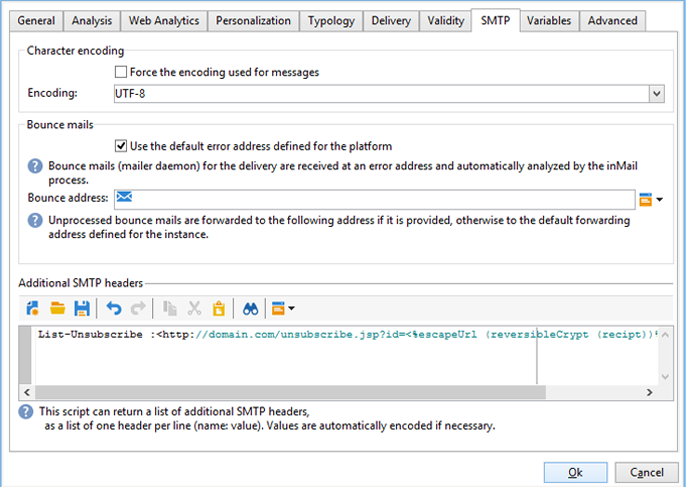

# Campaign Classic - 技術的な推奨事項 {#technical-recommendations}

Adobe Campaign Classicを使用する際に配信品質の割合を向上させるために使用できるテクニック、設定、ツールのいくつかを以下に示します。

## 設定 {#configuration}

### リバース DNS {#reverse-dns}

Adobe Campaign は、IP アドレスに対してリバース DNS が提供されているかどうか、そのリバース DNS が正しく IP を指しているかどうかを確認します。

ネットワーク設定で重要な点は、送信メッセージの IP アドレスごとに正しいリバース DNS が必ず定義されるようにすることです。つまり、特定の IP アドレスには、最初の IP アドレスにループバックする対応 DNS（A レコード）を記述したリバース DNS レコード（PTR レコード）があるということです。

特定の ISP を扱う場合には、リバース DNS のドメイン選択が影響を及ぼします。特に、AOL は、リバース DNS と同じドメインに属するアドレスのフィードバックループのみを受け付けます（[フィードバックループ](#feedback-loop)を参照）。

>[!NOTE]
>
>[この外部ツール](https://mxtoolbox.com/SuperTool.aspx)を使用して、ドメインの設定を検証できます。

### MX ルール {#mx-rules}

MX（Mail eXchanger）ルールは、送信サーバーと受信サーバーの間の通信を管理するルールです。

より正確に言えば、Adobe Campaign MTA(Message Transfer Agent)がEメールを個々のEメールドメインまたはISP（例えば、hotmail.com、comcast.net）に送信する速度を制御するために使用されます。 これらのルールは、通常、ISPによって公開された制限に基づいています（例えば、各SMTP接続あたり20件を超えるメッセージを含めないでください）。

>[!NOTE]
>
>Adobe Campaign ClassicでのMX管理について詳しくは、[この節](https://experienceleague.adobe.com/docs/campaign-classic/using/installing-campaign-classic/additional-configurations/email-deliverability.html#mx-configuration)を参照してください。

### TLS {#tls}

TLS（トランスポート層セキュリティ）は、暗号化プロトコルで、2 つの E メールサーバー間の接続を保護したり、E メールのコンテンツを保護して意図された受信者以外によって読まれないようにするために使用できます。

### 送信者のドメイン {#sender-domain}

HELOコマンドに使用するドメインを定義するには、インスタンスの設定ファイル(conf/config-instance.xml)を編集し、「localDomain」属性を次のように定義します。

```
<serverConf>
  <shared>
    <dnsConfig localDomain="mydomain.net"/>
  </shared>
</serverConf>
```

MAIL FROMドメインは、技術的なバウンスメッセージで使用されるドメインです。 このアドレスは、デプロイウィザードで、またはNmsEmail_DefaultErrorAddrオプションを使用して定義されます。

### SPFレコード {#dns-configuration}

SPFレコードは、現在、DNSサーバー上でTXTタイプレコード（コード16）またはSPFタイプレコード（コード99）として定義できます。 SPFレコードは、文字列の形式を取ります。 次に例を示します。

```
v=spf1 ip4:12.34.56.78/32 ip4:12.34.56.79/32 ~all
```

は、ドメイン用のeメールを送信する権限を持つ2つのIPアドレス(12.34.56.78と12.34.56.79)を定義します。 **～** は、その他のアドレスをSoftFailと解釈する必要があることを意味します。

Recommendations（SPFレコードを定義）:

* **～all**(SoftFail)または&#x200B;**-all**(Fail)を最後に追加すると、定義された以外のサーバーがすべて拒否されます。 これがなければ、サーバはこのドメインを（中立評価を使用して）偽装できます。
* **ptr**&#x200B;を追加しないでください（openspf.orgでは、コストがかかり信頼性が低いとして、これを推奨しています）。

>[!NOTE]
>
>SPFについて詳しくは、[この節](/help/additional-resources/authentication.md#spf)を参照してください。

## 認証

>[!NOTE]
>
>様々な形式のEメール認証について詳しくは、[この節](/help/additional-resources/authentication.md)を参照してください。

### DKIM {#dkim-acc}

>[!NOTE]
>
>ホストインストールまたはハイブリッドインストールで [Enhanced MTA](https://experienceleague.adobe.com/docs/campaign-classic/using/sending-messages/sending-emails/sending-an-email/sending-with-enhanced-mta.html#sending-messages) にアップグレードした場合、すべてのドメインのすべてのメッセージに対する DKIM の E メール認証署名は、Enhanced MTA がおこないます。

Adobe Campaign Classicで[DKIM](/help/additional-resources/authentication.md#dkim)を使用するには、次の前提条件が必要です。

**Adobe Campaignオプションの宣言**:Adobe Campaignでは、DKIM秘密鍵はDKIMセレクターとドメインに基づきます。同じドメイン／サブドメインに対して、セレクターの異なる複数の秘密鍵を作成することは、現時点ではできません。プラットフォームでも E メールでも、どのセレクタードメイン／サブドメインを認証に使用すべきかを定義することはできません。プラットフォームでは、その代わりに、秘密鍵のいずれか 1 つを選択します。つまり、認証は失敗する可能性が高くなります。

* お使いの Adobe Campaign インスタンスに DomainKeys を設定してある場合は、[ドメイン管理ルール](https://experienceleague.adobe.com/docs/campaign-classic/using/sending-messages/monitoring-deliveries/understanding-delivery-failures.html#email-management-rules)で **dkim** を選択するだけです。そうでない場合は、DomainKeys（DKIMに代わる）と同じ設定手順（秘密鍵/公開鍵）に従います。
* DKIM は DomainKeys の改良版なので、同じドメインに DomainKeys と DKIM の両方を有効にする必要はありません。
* 現在 DKIM が有効になっているドメインは、AOL および Gmail です。

## フィードバックループ {#feedback-loop-acc}

メッセージの送信に使用される IP アドレスの範囲に対して、特定の E メールアドレスを ISP レベルで宣言することにより、フィードバックループが機能します。ISP では、受信者からスパムとして報告されたメッセージを、バウンスメッセージの場合と同様の方法で、このメールボックスに送信します。苦情を訴えたユーザーへの今後の配信をブロックするように、プラットフォームを設定する必要があります。これらのユーザーが正しいオプトアウトリンクを使用しなかったとしても、そうしたユーザーにはもう連絡しないことが重要です。ISPがこれらの苦情に基づいて、IPアドレスを苦情に追加しブロックリストます。 ISP によっては、苦情率がおよそ 1％になると、IP アドレスがブロックリストに登録されます。

フィードバックループメッセージの形式を定義する標準 [Abuse Feedback Reporting Format（ARF）](https://tools.ietf.org/html/rfc6650)が現在策定中です。

インスタンスのフィードバックループを実装するには、次が必要です。

* 対象インスタンス専用のメールボックス（バウンスメールボックスとなる場合があります）
* 対象インスタンス専用の IP 送信アドレス

Adobe Campaign でシンプルなフィードバックループを実装する場合は、バウンスメッセージ機能が使用されます。フィードバックループメールボックスは、バウンスメールボックスとして使用され、これらのメッセージを検出するためのルールが定義されます。メッセージをスパムとして報告した受信者の E メールアドレスは、強制隔離リストに追加されます。

* **[!UICONTROL 管理／キャンペーン管理／配信不能件数の管理／メールルールセット]**&#x200B;で、理由として「**拒否**」、タイプとして「**ハード**」を指定してバウンスメールルール **Feedback_loop** を作成または変更します。
* メールボックスが特にフィードバックループ用に定義されている場合は、**[!UICONTROL 管理／プラットフォーム／外部アカウント]**&#x200B;で新しい外部バウンスメールアカウントを作成することにより、メールボックスにアクセスするためのパラメーターを定義します。

苦情の通知を処理するメカニズムが直ちに有効になります。このルールが正しく機能していることを確認するには、これらのメッセージが収集されないようにアカウントを一時的に無効にした後、フィードバックループメールボックスの内容を手動で確認します。サーバー上で、次のコマンドを順に実行します。

```
nlserver stop inMail@instance,
nlserver inMail -instance:instance -verbose.
```

複数のインスタンスに単一のフィードバックループアドレスを使用せざるを得ない場合は、次をおこなう必要があります。

* 受信したメッセージをインスタンスと同数のメールボックス上に複製します。
* インスタンスごとに各メールボックスが選択されるようにします。
* 関係するメッセージだけを処理するようにインスタンスを設定します。インスタンス情報は、Adobe Campaign から送信されるメッセージの Message-ID ヘッダーに含まれているので、フィードバックループメッセージにも含まれています。インスタンス設定ファイルの **checkInstanceName** パラメーターを指定するだけです（デフォルトでは、インスタンスは検証されず、その結果、特定のアドレスが誤って強制隔離される可能性があります）。

   ```
   <serverConf>
     <inMail checkInstanceName="true"/>
   </serverConf>
   ```

Adobe Campaign の配信品質サービスは、以下の ISP のフィードバックループサービスへのサブスクリプションを管理します。AOL、BlueTie、Comcast、Cox、EarthLink、FastMail、Gmail、Hotmail、HostedEmail、Libero、Mail.ru、MailTrust、OpenSRS、QQ、RoadRunner、Synacor、Telenor、Terra、UnitedOnline、USA、XS4ALL、Yahoo、Yandex、Zoho。

## List-Unsubscribe {#list-unsubscribe}

### List-Unsubscribe について {#about-list-unsubscribe}

配信品質の最適な管理を実現するには、**List-Unsubscribe** という SMTP ヘッダーを付けることが不可欠です。

このヘッダーは、「スパムとして報告」アイコンの代わりに使用できます。これを付けると、E メールインターフェイスに購読解除リンクが表示されます。

この機能を使用すると、評判を守ることができ、フィードバックは購読解除として実行されます。

List-Unsubscribe を使用するには、次のようなコマンドラインを入力する必要があります。

```
List-Unsubscribe: mailto: client@newsletter.example.com?subject=unsubscribe?body=unsubscribe
```

>[!CAUTION]
>
>上記の例は受信者テーブルに基づいています。データベースの実装が別のテーブルに基づいておこなわれている場合は、正しい情報を反映するようにコマンドラインを修正する必要があります。

次のコマンドラインは、動的な **List-Unsubscribe** の作成に使用できます。

```
List-Unsubscribe: mailto: %=errorAddress%?subject=unsubscribe%=message.mimeMessageId%
```

Gmail、Outlook.com、およびMicrosoft Outlookはこの方法をサポートしており、インターフェイスで直接購読解除ボタンを使用できます。 この手法を利用すると、苦情率が下がります。

**List-Unsubscribe**&#x200B;は、次のいずれかの方法で実装できます。

* 配信テンプレート](#adding-a-command-line-in-a-delivery-template)にコマンドラインを直接[追加
* [タイポロジルールの作成](#creating-a-typology-rule)

### 配信テンプレートへのコマンドラインの追加 {#adding-a-command-line-in-a-delivery-template}

コマンドラインは、E メールの SMTP ヘッダーの追加セクションに追加する必要があります。

この追加は E メールごとにおこなうこともできますし、既存の配信テンプレートでおこなうこともできます。また、この機能を組み込んだ配信テンプレートを新しく作成することもできます。

### タイポロジルールの作成 {#creating-a-typology-rule}

ルールには、コマンドラインを生成するスクリプトが含まれている必要があり、このルールを E メールヘッダーに組み込む必要があります。

>[!NOTE]
>
>タイポロジルールを作成することをお勧めします。各 E メールに List-Unsubscribe 機能が自動的に追加されます。

1. List-Unsubscribe: &lt;mailto:unsubscribe@domain.com>

   ユーザーが&#x200B;**購読解除**&#x200B;リンクをクリックすると、デフォルトの E メールクライアントが開きます。このタイポロジルールは、E メールの作成に使用されるタイポロジに追加する必要があります。

1. List-Unsubscribe: `<https://domain.com/unsubscribe.jsp>`

   ユーザーが&#x200B;**購読解除**&#x200B;リンクをクリックすると、購読解除フォームにリダイレクトされます。

   例：

   

>[!NOTE]
>
>Adobe Campaign Classicでタイポロジルールを作成する方法については、[この節](https://experienceleague.adobe.com/docs/campaign-classic/using/orchestrating-campaigns/campaign-optimization/about-campaign-typologies.html#typology-rules)を参照してください。

## E メールの最適化 {#email-optimization}

### SMTP {#smtp}

SMTP（Simple Mail Transfer Protoco）は、E メール送信のインターネット標準です。

ルールでチェックされない SMTP エラーは、**[!UICONTROL 管理]**／**[!UICONTROL キャンペーン管理]**／**[!UICONTROL 配信不能件数の管理]**／**[!UICONTROL 配信ログの検証]**&#x200B;フォルダーにリスト表示されます。これらのエラーメッセージは、デフォルトでは、到達不能なソフトエラーと解釈されます。

SMTP サーバーからのフィードバックを正しく検証する場合は、最もよく起こるエラーを特定し、それに対応するルールを&#x200B;**[!UICONTROL 管理]**／**[!UICONTROL キャンペーン管理]**／**[!UICONTROL 配信不能件数の管理]**／**[!UICONTROL メールルールセット]**&#x200B;に追加する必要があります。これをおこなわないと、プラットフォームは不要な再試行を実行したり（不明ユーザーの場合）、一定回数のテストの後に特定の受信者を誤って強制隔離したりすることになります。

### 専用の IP {#dedicated-ips}

アドビは、高いレピュテーションを得て配信パフォーマンスを最適化するために、ランプアップ IP を持つ各顧客に専用の IP 戦略を提供します。
