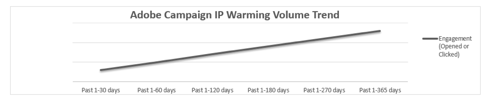

# IP ウォーミングによる電子メールの評判の向上

<!--
Increase your email reputation with IP warming

## IP Warming overview

In the Adobe Deliverability Consulting and Deliverability Operations teams, we have a vested interest in helping new Campaign customers be as successful as possible as they embark on the route of an IP warming process. If you've never been a part of such a project, you may have a lot of questions about it. Let's get down to the details!
-->

## はじめに

アドビ配信品質チームが顧客固有のプログラムを理解できるように、顧客はアドビと設定を共有する必要があります。 質問の内容は、アドビ配信品質チームが、顧客の送信評価と電子メールの量を把握できるように設計されています。 ビジネスモデル、メールマーケティングの目標、評判の指標を具体的に理解しない限り、戦略をカスタマイズすることはできず、配信品質の問題が発生するリスクがあります。

最初に、独自の専用IP （インターネットプロトコル）アドレスが割り当てられます。 メール送信のコンテキストでは、IP アドレスは、メールメッセージを顧客に配信するために使用されるルートです。 IP アドレスとドメインは、ネットワークで送信者を受信側 ISP に対して識別するために使用されます。 アドビは、送信量、電子メールプログラム、データセグメント化の方法、契約に基づいて、適切な数の電子メール送信用 IP アドレスを割り当てます。

**関連トピック：**

* [メールプラットフォームの切り替え時に移行をスムーズに行う方法](../../help/transition-process/switching-email-platforms.md)
* [IP 戦略](../../help/transition-process/infrastructure.md#ip-strategy)
* [IP ウォーミング時の ISP 固有の考慮事項](../../help/transition-process/isp-specific-considerations-during-ip-warming.md)

## IP ウォーミングを行う理由 {#why-ip-warming}

インターネットサービスプロバイダー（ISP）やメールボックスプロバイダー（MBP）は、未知の IP アドレスや送信ドメインを検出した際に予防策を講じます。 ISP／MBP は、IP と送信ドメインを詳細に調査し、この IP とドメインから送信されるメールがスパムかどうかを判断します。 これは、送信者のタイプに関係なく、新しい送信 IP アドレスに関連付けられた標準的な手順です。

ISP は、これらのメール送信から発生する送信量、送信頻度、苦情数、直帰率を注意深く調べます。 善かれあしかれ、これらはすべて送信者の評判の指標として注意深く調べられます。

もちろん、このようなデータポイントを調べるプロセスには時間がかかり、1、2 日では実現できません。 評判は時間と共に築かれるものです。 このプロセスは、見知らぬ人を家に入れるようなものです。 会ったことのない人を家に入れることを不安に思うでしょうか。

答えは「思う」である可能性が非常に高いです。 その人とその動機を分析したいと思うでしょう。 悪意はあるのか。 脅威なのか。 悪質なトラフィックや不要なトラフィックからネットワークを保護するために、ISP も同様に振る舞います。 肯定的な評価指標は、IP ウォーミングプロセスの成功に非常に役立ちます。 まずは少量のメールを送ることから始め、まずはエンゲージメントの高い顧客に最初に送り始めることの重要性を強調します。 詳しくは、[新しいトラフィックを送信する際のターゲティング条件](/help/transition-process/targeting-criteria.md)を参照してください。

新しい IP アドレスや複数の IP アドレスから大量の電子メールをゲート外に送信するのは最適な方法とは言えず、おそらく配信品質の問題を引き起こすでしょう。 ただし、少量の電子メールを送信し始め、推奨どおりに徐々に増やしたとしても、電子メールのベストプラクティスに従う必要があります。

## メール送信の権限（明示的なオプトイン）

これは、購読者の電子メールリストの管理と拡大に最も重要なコンポーネントです。 迷惑メール防止法が拡大し、国際的な取り組みが強化されるにつれて、マーケターは、リストの各購読者から明示的な（または明示的な）同意を得ていることを確認することが重要です。 つまり、各購読者は、ブランドからの電子メールの受信に積極的に同意しています。 これは、電子メールプログラムに明示的に登録せず、あるアクションを取った後に電子メールリストに追加される、暗黙の同意とは異なります。

詳しくは、[Adobeの使用可能な使用ポリシー](https://www.adobe.com/jp/legal/terms/aup.html)を参照してください。

## 評価指標：ISP が調査するもの

ISPは、外部ネットワークから受信するメールを配信するかどうかに関して、十分な情報を得た上で意思決定をおこなうために、高度なテクノロジーを利用しています。 このプロセスで役立つ複雑で独自のアルゴリズムがツールセットに含まれている場合もあります。

調査されるデータポイントの一部を以下に示します。

* スパムトラップヒット数
* ブロックリストヒット数
* 電子メールのバウンス数
* 購読者のエンゲージメント

ISP には、ポリシーとベストプラクティスに沿った特定の技術設定が必要です。 アドビは、お客様が責任を持ち信頼できる送信者であることを示すような IP アドレスと委任されたサブドメインを設定します。 これは[電子メール認証](/help/transition-process/infrastructure.md#authentication)と呼ばれます。 認証を使用すると、送信者がその IP アドレスまたはドメインから送信する権限を持っているかどうかを受信者が検証できます。

認証を使用すると、ISP は、ドメインまたは IP アドレスから送信している会社がその権限を持っていることを検証できます。 それは本質的に、あなたのアイデンティティを証明し、あなたが他の誰かであるふりをしていないこと、そして他の誰かがあなたであるふりをしていないことを確認するために行われます。

アドビでは、デフォルトで SPF と DKIM を設定し、リクエストに応じて DMARC を設定します。 ISP は、認証の主な形式として SPF と DKIM を参照します。 また、多くの ISP は、DMARC（ドメインベースのメッセージ認証、レポートおよび準拠）をフィルタリングの決定に組み込んでいます。 未認証のメールは、必ずしもブロックされるわけではありませんが、追加のフィルタリングが適用されます。

## IP ウォーミング：期待する内容

### 制限付きまたはブロックされたメール

スパムの発信者は常に新しい IP アドレスから送信しています。シャットダウンされるまで IP プールを使用して、別の IP プールで同じことを繰り返します。 その結果、ISP は新しい IP アドレスから送信されるトラフィックを慎重に処理します。 ISP が大量のメールを送信する IP をブロックするのは、スパムの発信者によって悪質なアクティビティが実行されていることを疑うからです。

その結果、新しいIPからメールを送信し始めると、延期メッセージやスロットリングされたメッセージが表示されることは珍しくありません。 数回再試行した後で、通常、メッセージは受け入れられ、配信されます。

新しい送信者を遅延させる ISP へのトラフィックの流れが通常になるには、数日かかる場合があります。 その場合でも、メール送信は停止せずに、最も関与の高い電子メール購読者への送信に焦点を合わせます。

まれに、ISP が新しい送信者をブロックする場合があります。 アドビは、アカウントを監視しており、そのようなブロックが疑われる場合は、ISP に問い合わせて、状況をできる限り適切に修正するように試みます。

ここで重要なのは一貫性です。 不規則な送信ボリュームパターンや頻繁に送信しない送信パターンは、途中で配信品質の問題を引き起こします。

### 苦情

[苦情](/help/metrics/complaints.md)は、購読者が電子メールプログラムを通じて電子メールをスパムとラベル付けした場合に発生します。 これにより、ISP に対して苦情アクティビティに関する通知が送信されます。 ISP に送信された苦情数が十分にある場合、ISP は顧客を保護するために行動します。多くの電子メールが購読者のインボックスに届かないようにブロックされる場合や、一部の電子メールが購読者のインボックスではなく、一斉メールフォルダーに届くようになる場合があります。 配信の問題が苦情によって引き起こされた場合は、受信者が苦情を申し立てている理由を特定することが重要です。

購読者はいろいろな理由で苦情を言います。 購読者が、同じトピックに関するメッセージが多すぎると感じたり、メッセージを期待していなかったり、メールを受信するためにサインアップしたことを覚えていなかったりするなど、何らかの理由でメールを受け取りたくないことがあります。

### データの有効性

ISP の配信不能なアドレスに送信すると、ハードバウンスが発生します。 アドレスの入力ミスや、以前アクティブだったが無操作状態が続いた後に閉鎖または終了したアドレスへのメール送信など、様々な理由で、アドレスに配信できない場合があります。

多数のハードバウンスが発生した場合、その理由を把握することが重要です。 アドレスの収集方法を確認し、許可が与えられたことを確認します。 メールアカウントを閉じた人が、マーケティングリストにそのアドレスがある人に通知しない場合があります。

### エンゲージメント

ISP は、ボリュームが一貫し、品質の良いデータを求めます。 4～8 週間かけて、トラフィックを徐々に着実に増加していきます。 ランプアップに必要な時間は、ボリュームと目標に基づいて異なりますが、通常は少なくとも 8 週間のプロセスです。

電子メールトラフィックは、徐々に着実に展開し、リスト全体を送信するまで毎週増やしていく必要があります。 さらに、各セグメントは、完了するまでスケジュールに従います。 まず最新の購読者から始めて、最後にエンゲージメントが最も少ない購読者で終了します。 また、一部の ISP では新しいトラフィックの扱い方が異なるので、よりカスタマイズされた方法を必要とする場合もあります。

[エンゲージメント](/help/engagement.md)についての詳細を表示

## コースの維持

推奨されるよりも多くの量を送信して、IP ウォーミングのプロセスで先を急ぎたくなるかもしれません。エンゲージメントの最も高い購読者を特定する時間をかけず、そうした購読者に最初にメールを送信することなく、肯定的な評判を築きたくなるかもしれません。 この衝動に逆らって下さい。 長い目で見ると、これは役に立ちません。

エンゲージメントの高い顧客に（メールで）電子メールを配信することは、非常に重要です。 IP ウォーミングの初期段階でのみ購読者。 これらの顧客は最も価値のある顧客であり、電子メールを開く傾向は、興味深くニーズの高いメールを送信するマーケターであることをISPに示すのに役立ちます。 また、規則に準拠してベストプラクティスに従っているマーケターであることも ISP に示せます。

## まとめ

注意：IP ウォーミングはマラソンです。短距離走ではありません。  このプロセスは、煩わしく時間のかかる作業のように思えるかもしれませんが、信頼できる真の電子メールのベストプラクティスに従わずに損傷した評判を修復しようと試みるほうが、より多くの作業を伴います。

優れた送信プラクティスであるほど、ISP に対する評判スコアが高く、電子メールが配信される可能性が高くなります。 IP ウォーミングとランプアップは、メールのデザインに関するベストプラクティスに従うことで、受信トレイへの配信を最適化するのに役立ちます。

アドビのグローバル配信品質チームは、このプロセスのパートナーであり、IP ウォーミング段階でお客様の成功を支援します。
