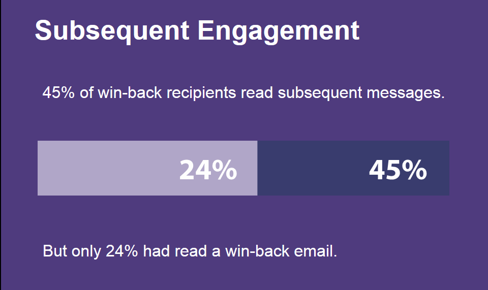

# 再エンゲージメントのベストプラクティス {#re-engagement}

配信品質を実装する際のベストプラクティスとしては、正常な購読者ベースを維持し、再エンゲージメント（または復活）戦略を通じて配信品質を向上させることがあります。

* 健全な購読者ベースを維持することは、高品質で一貫性のある配信を確実におこなうための重要な要素の 1 つです。多くの配信品質の問題は、データの処理やメンテナンスの方法が不適切であることが原因で発生します。
* 現在、マーケターが直面することが特に多い問題の 1 つは、アクティブでない購読者のアクティビティです（これは、低エンゲージメントまたはエンゲージメントなしとも呼ばれます）。これにより、メールの配信に悪影響が及び、ROI が低下する場合があります。

>[!NOTE]
>
>再エンゲージメントキャンペーン戦略とアドビの配信品質サービスについて詳しくは、担当の配信品質コンサルタントまたはアドビの販売代理店までお問い合わせください。

## ISP はエンゲージメント以外のアクティビティをどのように見ていますか？ {#how-do-isps-view-non-engagement-activity-}

長年の間、ISP は、ユーザーからのエンゲージメントフィードバック指標を使用して、メッセージを配置する場所やメッセージを配信するかどうかを決定してきました。ユーザー [ エンゲージメント ](/help/engagement.md) は、ポジティブフィードバックとネガティブフィードバックの両方で構成され、ISP は両方を一定ベースで監視します。 エンゲージメントがないことは、おそらく、否定的なエンゲージメントの主な一因となります。配信品質の観点では、エンゲージメントを見せないユーザーに変わることなくキャンペーンを送信し続けると、IP アドレスとドメインのレピュテーションが全体的に低下するおそれもあります。

Gmail、Microsoft®、OATH などの ISP は、エンゲージメントがないことを不要なメールと見なし、メッセージをスパムフォルダーにリダイレクトし始めます。 また、これらの購読者がメールアカウントを所有しなくなり、これを「リサイクル」スパムトラップとして使用することができます。 これは、アドレスがしばらくの間無効であり、すべてのメッセージが拒否されることを意味します。 購読者の管理システムが「ハードバウンス」アドレスを削除していない場合は、スパムトラップに送信される可能性が高く、配信に関する重大な問題が発生する可能性があります。

## 無操作状態にはどのように対処すべきですか？ {#how-should-you-approach-inactivity-}

Adobeプラットフォームを使用するお客様は、オープンを確認し、セグメントに応じてデータをクリックすることで、インスタンス内の非アクティブ状態を表示できます。 エンゲージメントがないと配信が妨げられる可能性があるので、まず考えられるのは、データベースから購読者を削除することです。 ただし、これは誤ったオプションであることが判明する場合があります。 したがって、メールの受信に興味のある購読者を維持し、アクティビティを表示しなくなった購読者を徐々に段階的に排除するには、再エンゲージメント（別名：ウィンバック）戦略が最適な推奨事項です。

## リエンゲージメントキャンペーンは本当に機能しますか？ {#do-re-engagement-campaigns-really-work-}

Return Path の調査によれば、再エンゲージメントキャンペーンでは、開封率が 12％という結果が出ました。これに対して、通常のキャンペーンでは、開封率が平均 14％という結果が出ました。再エンゲージメントキャンペーンを読んだのは購読者の 24％に過ぎませんでしたが、そのうちの約 45％は、後続のメッセージを読みました。

## 再エンゲージメントキャンペーンを作成するにはどうすればよいですか？ {#how-do-you-create-a-re-engagement-campaign-}

### フェーズ 1 {#phase-1}

* 最初のステップは、開封またはクリックアクティビティがほとんどない購読者を特定し、それに応じて、設定された時間枠に基づいてこのグループをセグメント化することです。 経験則として、過去 90 日以内にメールを開封またはクリックしなかった購読者を確認します。 ただし、これは、ビジネスの性質によって異なります（季節による送信数の変動など）。
* 期間を定義する際に注意すべきもう 1 つの点は、ISP およびブロックリスト企業ではエンゲージメントが継続するのは 1.5～1.8 年の間であると考えていることです。また、購入や web サイトのアクティビティなどの行動活動、またはサインアップ段階や最初の連絡時の環境設定などの他のタッチポイントについても説明します。

### フェーズ 2 {#phase-2}

* セグメントを定義したら、次の手順では、識別された指標に従って、購読者のニーズを満たす再エンゲージメントキャンペーンを作成します。件名行を作成すると、購読者の関心を高めることができます。 Return Path の調査によると、件名およびコンテンツで「戻ってきてほしい」よりも「寂しく思っていた」ということを伝えると、応答率が向上します。
* 再エンゲージメントのためにメールでインセンティブを提供することもできます。ディスカウント付きのオファーを検討している場合、パーセントではなく金額を提示することをお勧めします。リターンパスでは、応答率が高くなるので、これを行うことも推奨します。 最後に、A/B 分岐テストを実行して、応答率と成功率を確認することも便利なオプションです。

### フェーズ 3 {#phase-3}

次の手順では、再エンゲージメントキャンペーンの頻度を決定します。再確認メッセージとは異なり、再エンゲージメントキャンペーンは、ゆっくり時間をかけて一連のメールを送信することにより、購読者に戻ってきてもらうことを目的としています。次の例は、頻度の例を示しています。

開封アクティビティやクリックアクティビティを実行してキャンペーンにエンゲージした購読者は、購読者のエンゲージメントリストに再び追加されます。

### フェーズ 4 {#phase-4}

* 次のフェーズでは、アクティビティを継続的に示していない購読者を特定し、一定期間をかけて徐々にその購読者へのメール送信を減らしていきます。過去 1 年以内にアクティビティがない場合、その購読者のメール購読は、保留にすることをお勧めします。メールコンテンツに関心を示したことはありませんが、1 回限りの再確認キャンペーンを送信することで、購読を再アクティブ化する最後のチャンスが常にあります。
* 再確認キャンペーンは、非アクティブな購読者が購読リストに残りたい場合に、その購読者に長時間質問する優れた方法です。 キャンペーンを作成するときは、「こちらをクリック」というリンクを追加して、購読者がアクションを確認し、自分のアドレスを検証できるようにすることをお勧めします。このようにして、アクションをデータベースに記録することが可能です。再確認メールの例を次に示します。

  

  購読者がアクションを実行すると、再購読の確認を含むランディングページが提供されます。 ランディングページの例を次に示します。

  

## 製品固有のリソース

**Adobe Campaign**

* [Campaign Classic内のトラッキングログ ](https://experienceleague.adobe.com/docs/campaign-classic/using/sending-messages/monitoring-deliveries/delivery-dashboard.html?lang=ja#tracking-logs)
* [Campaign Standard内のトラッキングログ ](https://experienceleague.adobe.com/docs/campaign-standard/using/testing-and-sending/sending-and-tracking-messages/tracking-messages.html?lang=ja#tracking-logs)

**Adobe カスタマージャーニー管理**

* [ メッセージトラッキング ](https://experienceleague.adobe.com/docs/journey-optimizer/using/reporting/message-tracking.html?lang=ja)
