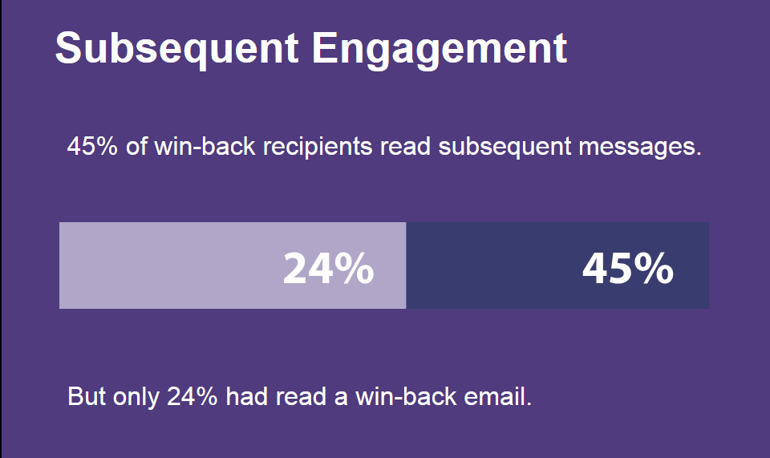
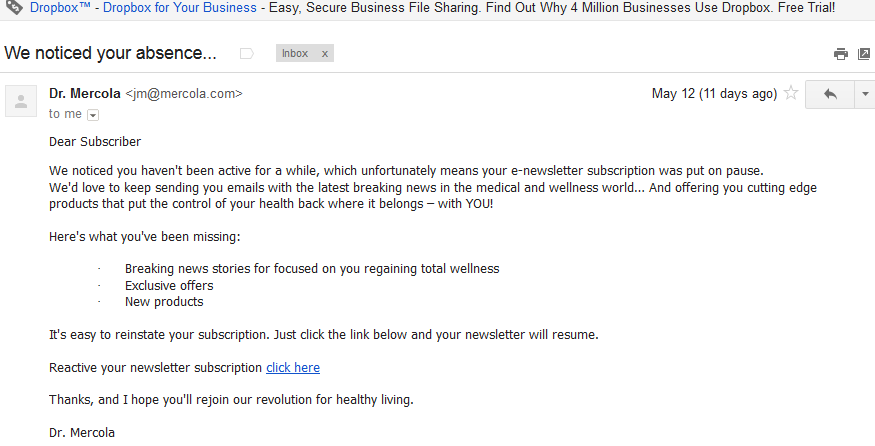

# 再エンゲージメントのベストプラクティス {#re-engagement}

配信品質を導入する際のベストプラクティスのいくつかは、健全な顧客基盤を維持し、リエンゲージメント（または「ウィンバック」）戦略を通じて配信品質を向上させることにあります。

* 健全な購読者ベースを維持することは、高品質で一貫性のある配信を確実におこなうための重要な要素の 1 つです。 多くの配信品質の問題は、データの処理やメンテナンスの方法が不適切であることが原因で発生します。
* 現在、マーケターが直面することが特に多い問題の 1 つは、非アクティブな購読者のアクティビティです（これは、低エンゲージメントまたはエンゲージメントなしとも呼ばれます）。これにより、メールの配信に悪影響が及び、ROI が低下する場合があります。

>[!NOTE]
>
>再エンゲージメントキャンペーン戦略とアドビの配信品質サービスについて詳しくは、担当の配信品質コンサルタントまたはアドビの販売代理店までお問い合わせください。

## ISPは、非エンゲージメントアクティビティをどのように表示しますか？ {#how-do-isps-view-non-engagement-activity-}

長年の間、ISP は、ユーザーからのエンゲージメントフィードバック指標を使用して、メッセージを配置する場所やメッセージを配信するかどうかを決定してきました。 ユーザー[&#x200B; エンゲージメント &#x200B;](/help/engagement.md)は、肯定的なフィードバックと否定的なフィードバックの両方で構成され、ISPは両方を常に監視します。 エンゲージメントがないことは、おそらく、否定的なエンゲージメントの主な一因となります。 配信品質の観点では、エンゲージメントを見せないユーザーに変わることなくキャンペーンを送信し続けると、IP アドレスとドメインのレピュテーションが全体的に低下するおそれもあります。

Gmail、Microsoft®OATHなどのISPは、エンゲージメントしていない電子メールを望ましくない電子メールと見なし、迷惑メールフォルダーにメッセージをリダイレクトします。 また、これらの購読者はメールアカウントを所有しなくなり、これは「リサイクルされた」スパムトラップとして使用できます。 これは、アドレスがしばらく無効であり、すべてのメッセージが拒否されることを意味します。 購読者管理システムが「ハードバウンス」アドレスを削除しない場合、メール配信のトラップに移動する可能性が高くなり、重大な配信の問題につながる可能性があります。

## 非活動にどのように取り組むか？ {#how-should-you-approach-inactivity-}

Adobe Platformを使用するお客様は、セグメントに応じて開封済みデータとクリック済みデータを確認することで、インスタンス内の非アクティブ状態を確認できます。 エンゲージメントを怠ると、配信が妨げられる可能性があるため、まず最初に考えるのは、データベースから登録者を除外することです。 しかし、これは時には間違った選択肢となることもあります。 そのため、リエンゲージメント（ウィンバックとも呼ばれます）戦略は、メールの受信に関心のある購読者を維持し、活動を示さない購読者を徐々に段階的に除外するための最良の推奨事項です。

## リエンゲージメント施策は本当に効果があるのか？ {#do-re-engagement-campaigns-really-work-}

Return Path の調査によれば、再エンゲージメントキャンペーンでは、開封率が 12％という結果が出ました。これに対して、通常のキャンペーンでは、開封率が平均 14％という結果が出ました。 再エンゲージメントキャンペーンを読んだのは購読者の 24％に過ぎませんでしたが、そのうちの約 45％は、後続のメッセージを読みました。

## どのようにリエンゲージメント施策を実施するのですか？ {#how-do-you-create-a-re-engagement-campaign-}

### フェーズ 1 {#phase-1}

* 最初のステップは、開封やクリックのアクティビティがほとんどない購読者を特定し、設定された時間枠にもとづいてグループをセグメンテーションすることです。 経験則として、過去90日以内に電子メールを開封またはクリックしていない顧客をレビューすることが挙げられます。 ただし、これは、ビジネスの性質によって異なります（季節による送信数の変動など）。
* 期間を定義する際に注意すべきもう 1 つの点は、ISP およびブロックリスト企業ではエンゲージメントが継続するのは 1.5～1.8 年の間であると考えていることです。 また、購入やweb サイトでのアクティビティなどの行動アクティビティ、またはサインアップ段階や最初の連絡先における嗜好などの他の顧客接点も考慮します。

### フェーズ 2 {#phase-2}

* セグメントを定義したら、次の手順では、識別された指標に従って、購読者のニーズを満たす再エンゲージメントキャンペーンを作成します。 件名を作成することで、購読者の興味を高めることができます。 Return Path の調査によると、件名およびコンテンツで「戻ってきてほしい」よりも「寂しく思っていた」ということを伝えると、応答率が向上します。
* 再エンゲージメントのためにメールでインセンティブを提供することもできます。 ディスカウント付きのオファーを検討している場合、パーセントではなく金額を提示することをお勧めします。 Return Pathでは、レスポンス率が高くなるため、この方法を採用することも提案しています。 最後に、A/B スプリットテストを実施して、レスポンスと成功率を確認することも有効な選択肢です。

### フェーズ 3 {#phase-3}

次の手順では、再エンゲージメントキャンペーンの頻度を決定します。 再確認メッセージとは異なり、再エンゲージメントキャンペーンは、ゆっくり時間をかけて一連のメールを送信することにより、購読者に戻ってきてもらうことを目的としています。 次の例は、頻度の例を示しています。

開封アクティビティやクリックアクティビティを実行してキャンペーンにエンゲージした購読者は、購読者のエンゲージメントリストに再び追加されます。

### フェーズ 4 {#phase-4}

* 次のフェーズでは、アクティビティを継続的に示していない購読者を特定し、一定期間をかけて徐々にその購読者へのメール送信を減らしていきます。 過去 1 年以内にアクティビティがない場合、その購読者のメール購読は、保留にすることをお勧めします。 メールの内容には興味を示していませんが、1回限りの再確認キャンペーンを送信することで、購読を再開させる最後のチャンスは常にあります。
* 長期間非アクティブな購読者に対して、購読リストに残りたいかどうかを尋ねる優れた方法は、再確認キャンペーンです。 キャンペーンを作成するときは、「こちらをクリック」というリンクを追加して、購読者がアクションを確認し、自分のアドレスを検証できるようにすることをお勧めします。 このようにして、アクションをデータベースに記録することが可能です。 再確認メールの例を次に示します。

  

  顧客がアクションを起こすと、サブスクリプションの確認を含むランディングページが提供されます。 ランディングページの例を次に示します。

  

## 製品固有のリソース

**Adobe Campaign**

* [Campaign Classicのトラッキングログ](https://experienceleague.adobe.com/docs/campaign-classic/using/sending-messages/monitoring-deliveries/delivery-dashboard.html#tracking-logs)
* [Campaign Standardのトラッキングログ](https://experienceleague.adobe.com/docs/campaign-standard/using/testing-and-sending/sending-and-tracking-messages/tracking-messages.html#tracking-logs)

**Adobe カスタマージャーニー管理**

* [メッセージトラッキング](https://experienceleague.adobe.com/docs/journey-optimizer/using/reporting/message-tracking.html?lang=ja)
