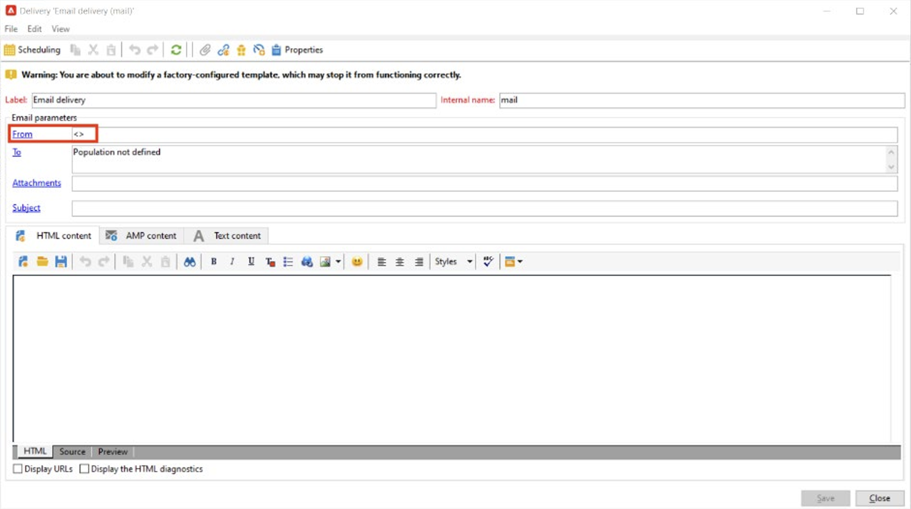

# [!DNL Domain-based Message Authentication, Reporting and Conformance]を実装する（DMARC）

このドキュメントの目的は、電子メール認証方式であるDMARCに関する詳細情報を読者に提供することです。 DMARCの仕組みと様々なポリシーオプションについて説明することで、DMARCがメール配信に与える影響をより深く理解できます。

## DMARC とは {#about}

Domain-based Message Authentication, Reporting and Conformanceは、ドメイン所有者がドメインを不正使用から保護できるようにするメール認証方法です。 また、DMARC はメール認証ステータスに関するフィードバックを提供し、認証に失敗したメールの処理を送信者が制御できるようにします。 これには、実装されている DMARC ポリシーに応じて、メールを監視、隔離、強制隔離、拒否するオプションが含まれます。

DMARC には次の 3 つのポリシーオプションがあります。

* **監視（p=none）:** メールボックスプロバイダー/ISPに、通常はメッセージに対して行う処理を指示します。
* **強制隔離（p=強制隔離）:** メールボックスプロバイダー/ISPに対して、DMARCを受信者の迷惑メールフォルダーまたは迷惑メールフォルダーに渡さないメールを配信するように指示します。
* **拒否（p=reject）:** メールボックスプロバイダー/ISPに対し、DMARCを通過しないメールをブロックしてバウンスが発生するように指示します。

## DMARC の仕組み {#how}

SPF と DKIM はいずれも、メールをドメインに関連付け、連携してメールを認証するために使用されます。 DMARCは、これをさらに一歩進め、DKIMとSPFによってチェックされたドメインに一致させることで、スプーフィングを防ぐのに役立ちます。 DMARC 認証に合格するには、メッセージが SPF または DKIM に合格する必要があります。 これらの両方が認証に失敗した場合、DMARC は失敗し、選択した DMARC ポリシーに従ってメールが配信されます。

>[!NOTE]
>
>DMARCでは、「差出人」アドレスと「Return-Path」アドレスの整合性が必要です。

## DMARCを導入すべき理由？ {#why}

DMARCはオプションで、必須ではありませんが、無料で利用でき、メール受信者はメールの認証を簡単に識別できるため、配信が向上する可能性があります。 DMARCの主な利点の1つは、どのメッセージがSPFやDKIMに失敗したかをレポートで確認できることです。 また、これらの認証方法のいずれかを通過しないメールの処理を、送信者がある程度コントロールすることができます。 DMARCのレポート機能を利用すれば、送信者は、DMARCで検出されないメッセージを把握し、それ以上のエラーを低減するためのステップを実施できます。

>[!NOTE]
>
>BIMIを導入する場合は、p=quarantineまたはp=reject DMARC ポリシーが必要です。

## DMARCの実装に関するベストプラクティス {#best-practice}

DMARCはオプションなので、ESPのプラットフォームではデフォルトで設定されません。 DMARC レコードを機能させるには、ドメインのDNSで作成する必要があります。 さらに、DMARCレポートを社内のどこに保管する必要があるのかを示すには、お客様が選択したメールアドレスが必要です。 ベストプラクティスとして
DMARCの潜在的な影響についてDMARCで理解を深める際には、DMARC ポリシーをp=noneからp=quarantine、p=rejectにエスカレーションして、DMARCの実装をゆっくりと展開することをお勧めします。

1. 受信して使用するフィードバックを分析します（p=none）。これにより、認証に失敗したメッセージに対してアクションを実行せずに、送信者にメールレポートを送信するように受信者に指示します。 また、正当なメッセージが認証に失敗する場合は、SPF／DKIM の問題を確認および修正します。
1. SPFとDKIMが連携して、すべての正当な電子メールに対して認証を渡しているかどうかを確認し、ポリシーをに移動します（p=quarantine）。これにより、受信メールサーバーに対して、認証に失敗した電子メールを隔離するように指示します（通常、これらのメッセージを迷惑メールフォルダーに配置します）。
1. ポリシーを（p=reject）に調整します。 p= reject ポリシーは、認証に失敗したドメインのメールを完全に拒否（バウンス）するよう受信者に指示します。 このポリシーを有効にすると、ドメインで 100％認証された電子メールのみがインボックスにも配置される可能性があります。

   >[!NOTE]
   >
   >このポリシーを慎重に使用し、お客様の組織に適しているかどうかを判断してください。

## DMARC レポート {#reporting}

DMARCでは、SPF/DKIMに失敗したメールに関するレポートを受け取ることができます。 送信者がDMARC ポリシーのRUA/RUF タグを通じて受信できる認証プロセスの一部として、ISP サービスによって生成される2つの異なるレポートがあります。

* **集計レポート （RUA）:**&#x200B;には、GDPRに準拠しないPII （個人を特定できる情報）が含まれていません。
* **フォレンジックレポート （RUF）:**&#x200B;には、GDPRに準拠しない電子メールアドレスが含まれています。 利用する前に、GDPRに準拠する必要がある情報の扱い方を社内で確認することをお勧めします。

これらのレポートの主な用途は、スプーフィングが試みられたメールの概要を受け取ることです。 これらのレポートは、サードパーティ製ツールを通じて収集し、最も的確に分析できる、高度に技術的なレポートです。 DMARCのモニタリングを専門とする企業には、次のようなものがあります。

* [ValiMail](https://www.valimail.com/products/#automated-delivery)
* [アガリ](https://www.agari.com/)
* [ダルシア語](https://dmarcian.com/)
* [プルーフポイント](https://www.proofpoint.com/us)

>[!CAUTION]
>
>レポートを受信するために追加するメールアドレスが DMARC レコードを作成したドメインの外部にある場合は、その外部ドメインを承認して、このドメインを所有していることを DNS に指定する必要があります。 これを行うには、[dmarc.org ドキュメント](https://dmarc.org/2015/08/receiving-dmarc-reports-outside-your-domain)で詳しく説明されている手順に従います。

### DMARC レコードの例 {#example}

```
v=DMARC1; p=reject; fo=1; rua=mailto:dmarc_rua@emaildefense.proofpoint.com;ruf=mailto:dmarc_ruf@emaildefense.proofpoint.co
```

## DMARCのタグとその役割 {#tags}

DMARC レコードには、DMARC タグと呼ばれる複数のコンポーネントがあります。 各タグには、DMARCの特定の側面を指定する値があります。

| タグ名 | 必須／オプション | 関数 | 例 | デフォルト値 |
|  ---  |  ---  |  ---  |  ---  |  ---  |
| v | 必須 | このDMARC タグは、バージョンを指定します。 現時点では1つのバージョンしか存在しないので、これはv=DMARC1の固定値になります | V=DMARC1 DMARC1 | DMARC1 |
| p | 必須 | 選択したDMARC ポリシーを表示し、認証チェックに失敗したメールの報告、強制隔離または拒否を受信者に指示します。 | p=none、強制隔離、または拒否 | - |
| fo | オプション | ドメイン所有者がレポートオプションを指定できるようにします。 | 0：すべてが失敗した場合はレポートを生成<br/>1：何かが失敗した場合はレポートを生成<br/>d: DKIMが失敗した場合はレポートを生成<br/>s: SPFが失敗した場合はレポートを生成 | 1 （DMARC レポートの場合に推奨） |
| pct | オプション | フィルタリングの対象となるメッセージの割合を示します。 | pct=20 | 100 |
| rua | オプション（推奨） | 集計レポートの配信先を指定します。 | `rua=mailto:aggrep@example.com` | - |
| ruf | オプション（推奨） | フォレンジックレポートの配信先を特定します。 | `ruf=mailto:authfail@example.com` | - |
| sp | オプション | 親ドメインのサブドメインに対するDMARC ポリシーを指定します。 | sp=reject | - |
| adkim | オプション | Strict （s）またはRelaxed （r）のいずれかを指定できます。 ゆるやかな整列とは、DKIM署名で使用されるドメインを「差出人」アドレスのサブドメインにできることを意味します。 厳密な整列とは、DKIM署名で使用されるドメインが、差出人アドレスで使用されるドメインと完全に一致している必要があることを意味します。 | adkim=r | r |
| aspf | オプション | Strict （s）またはRelaxed （r）のいずれかを指定できます。 ゆるやかな整列とは、ReturnPath ドメインが差出人アドレスのサブドメインである可能性があることを意味します。 厳密な整列とは、Return-Path ドメインがFrom アドレスと完全に一致する必要があることを意味します。 | aspf=r | r |

## DMARCとAdobe Campaign {#campaign}

>[!NOTE]
>
>Campaign インスタンスがAWSでホストされている場合は、Campaign コントロールパネルを使用してサブドメインにDMARCを実装できます。 [Campaign コントロールパネル](https://experienceleague.adobe.com/docs/control-panel/using/subdomains-and-certificates/txt-records/dmarc.html)を使用してDMARC レコードを実装する方法を説明します。

DMARCのエラーの一般的な理由は、「From」と「Errors-To」または「Return-Path」のアドレスの間の不整合です。 これを回避するには、DMARCを設定する際に、配信テンプレートで「送信元」と「エラー先」のアドレス設定を再確認することをお勧めします。

1. 配信テンプレート内で、現在「送信元」アドレスとして設定されているアドレスを確認します。

   

1. ここから、「プロパティ」を選択すると、配信テンプレートをさらに編集できます。 このウィンドウで、「SMTP」を選択し、選択した場合は「プラットフォームに定義されたデフォルトのエラーアドレスを使用する」のチェックを外します。 Adobe Campaignの配信テンプレートは、デフォルトでこのチェックボックスをオンにします。 デフォルトのエラーアドレスは、この配信テンプレートの送信元アドレスに関連付けられているアドレスではない可能性があります。

   

1. このチェックボックスをオフにすると、差出人アドレスで設定したドメインと同じドメインを使用する一意のエラーアドレスを入力できるテキストフィールドが表示されます。

   

変更内容が保存されると、DMARCの実装を正しく進めることができます。

## 便利なリンク {#links}

* [DMARC.org](https://dmarc.org/){target="_blank"}
* [M3AAWG メール認証](https://www.m3aawg.org/sites/default/files/document/M3AAWG_Email_Authentication_Update-2015.pdf){target="_blank"}
