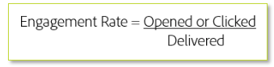

# ターゲティング設定条件

新しいトラフィックを送信する場合は、IP ウォーミングの初期段階で、最もエンゲージメントの高い顧客のみをターゲティングします。 これにより、早い段階で肯定的なレピュテーションを確立し、エンゲージメントの低いオーディエンスが流入する前に効果的に信頼を構築できます。 エンゲージメントの基本的な公式を次に示します。

通常、エンゲージメント率は特定の期間に基づいています。 この指標は、公式が全体的なレベルで適用されているか、特定のメーリングタイプやキャンペーンに適用されているかによって大きく異なる場合があります。 送信者やISPごとにカスタマイズされたプランが必要となるため、Adobeの配信品質コンサルタントと連携して、特定のターゲティング基準を提供する必要があります。

## 製品固有のリソース

**Analytics**

* [&#x200B; エンゲージメント率と顧客維持率を向上させる方法（チュートリアル） &#x200B;](https://experienceleague.adobe.com/docs/analytics-learn/tutorials/mobile-app-analytics/measuring-mobile-analytics/how-to-increase-engagement-and-retention-rates.html?lang=ja#mobile-app-analytics): *コホートを使用して、エンゲージメントの高いオーディエンスの行動を特定し、モバイルアプリでスティッキーが発生する根本原因を把握します。 セグメント IQでデータ サイエンス アルゴリズムを使用して、セグメント間の相違点と類似点を把握します。*

**Campaign Standard**

* [AIを活用したメール：予測エンゲージメントスコアリング](https://experienceleague.adobe.com/docs/campaign-standard/using/testing-and-sending/preparing-and-testing-messages/predictive.html?lang=ja#predictive-scoring)
